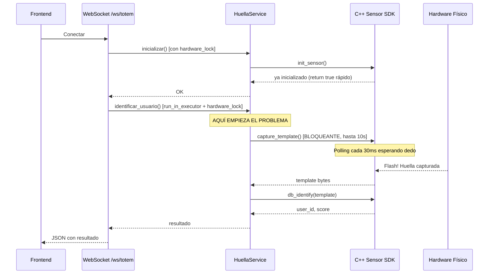

# 🔍 Diagnóstico: Inconsistencia del Sistema de Huellas

## Síntoma
- **1 de cada 4 veces** el sistema reacciona de inmediato
- Las otras 3 veces: el flash del sensor aparece (huella capturada por hardware), pero **nada llega al sistema** por 3-5+ segundos
- No se muestra rechazo ni éxito — simplemente parece muerto

---

## Flujo actual del WebSocket `/ws/totem`



---

## 🔴 Causa Raíz #1: `hardware_lock` bloquea TODO

[HuellaService.py:L54](file:///c:/Proyectos/Pydigitador/core/Services/userServces/Atributos/HuellaService.py#L54) y [L81](file:///c:/Proyectos/Pydigitador/core/Services/userServces/Atributos/HuellaService.py#L81)

```python
def inicializar(self) -> tuple[bool, str]:
    with self.hardware_lock:  # ← LOCK #1
        ...

def identificar_usuario(self) -> tuple[int, float]:
    with self.hardware_lock:  # ← LOCK #2 (BLOQUEANTE 10 SEGUNDOS)
        for intento in range(3):
            exito, data_lista = self.sensor.capture_template()  # ← espera hasta 10s
```

**El `hardware_lock` es un `threading.Lock()`**. Cuando `identificar_usuario()` está esperando que alguien ponga el dedo (hasta **10 segundos**), el lock se mantiene tomado. Si durante ese tiempo el frontend se desconecta y reconecta (por el `autoReturnToWaiting`), la nueva conexión llama a `inicializar()` que queda **bloqueada esperando el lock anterior**.

> **Resultado**: Las conexiones se acumulan, cada una esperando que la anterior termine su timeout de 10s.

## 🔴 Causa Raíz #2: Polling loop en C++ consume CPU y bloquea GIL

[Sensor.cpp:L224-L258](file:///c:/Proyectos/Pydigitador/infra/Hardware/Sensor.cpp#L224-L258)

```cpp
while (std::chrono::steady_clock::now() < deadline) {
    ret = ZKFPM_AcquireFingerprint(...);
    if (ret == ZKFP_ERR_OK) { break; }
    // sleep 30ms y reintentar
    std::this_thread::sleep_for(std::chrono::milliseconds(m_pollIntervalMs));
}
```

Este loop de C++ **retiene el GIL de Python** durante los 30ms de sleep porque pybind11 no lo libera automáticamente. El `run_in_executor` usa un thread pool, pero el GIL sigue bloqueado, **paralizando el event loop de asyncio** intermitentemente. Esto causa:
- Respuestas lentas del servidor HTTP
- WebSocket messages que no se envían hasta que el GIL se libera

## 🔴 Causa Raíz #3: Auto-reconexión agresiva del Frontend

[renderer.js:L134-L139](file:///c:/Proyectos/Pydigitador/Frontend/src/js/renderer.js#L134-L139)

```javascript
ws.onclose = () => {
    if (!responded) {
        activeWs = null;
        activarSensor(); // ← RECONECTA INMEDIATAMENTE
    }
};
```

Cuando el WebSocket se cierra sin respuesta (timeout del servidor), el frontend **reconecta inmediatamente**. Esto crea una cadena:

1. WS conecta → `identificar_usuario()` empieza a esperar (10s)
2. WS timeout (20s asyncio) → cierra → `onclose` → reconecta
3. Nuevo WS llama `inicializar()` → queda bloqueado en `hardware_lock` porque el thread anterior aún no terminó
4. El thread anterior finalmente termina, captura llega tarde, pero el WS ya se cerró

## 🔴 Causa Raíz #4: `inicializar()` se llama en CADA conexión WebSocket

[main.py:L540](file:///c:/Proyectos/Pydigitador/infra/main.py#L540)

```python
exito, msg = hardware_service.inicializar()
```

`initSensor()` del C++ verifica `if (m_isInitialized) return true;`, así que no re-inicializa realmente. **Pero igual toma el `hardware_lock` cada vez**, compitiendo con el `identificar_usuario()` que puede estar en curso.

## 🔴 Causa Raíz #5: 3 reintentos de identificación

[HuellaService.py:L84](file:///c:/Proyectos/Pydigitador/core/Services/userServces/Atributos/HuellaService.py#L84)

```python
for intento in range(3):
    exito, data_lista = self.sensor.capture_template()
```

Si la primera captura falla (mala calidad), **hace hasta 3 capturas de 10 segundos cada una**, manteniendo el lock por hasta **30 segundos**. Mientras tanto, todo se congela.

---

## 📐 Resumen: Por qué 1/4 veces funciona

| Escenario | Qué pasa | % aprox |
|---|---|---|
| Dedo rápido + sin competencia de lock | Funciona instantáneo ✅ | ~25% |
| Dedo rápido pero lock tomado por conexión anterior | Espera 1-10s hasta que lock se libere ⏳ | ~25% |
| Captura pobre → reintento | Lock tomado por 10-20s adicionales 🐌 | ~25% |
| Reconexión del frontend compite con capture | Lock nunca se libera a tiempo, timeout 💀 | ~25% |

---

## 🛠️ Plan de Fix

### Fix 1: Liberar el GIL en C++ durante el polling (CRÍTICO)

En el wrapper de pybind11, liberar el GIL para que asyncio pueda seguir trabajando:

```cpp
// sensorWrapper.cpp
.def("capture_template", [](Sensor &s) {
    std::vector<unsigned char> data;
    bool ok;
    {
        py::gil_scoped_release release;  // ← LIBERA EL GIL
        ok = s.captureCreateTemplate(data);
    }
    return std::make_pair(ok, data);
})
```

> [!IMPORTANT]
> **Este es el fix más impactante.** Sin esto, cada poll de 30ms paraliza todo Python.

### Fix 2: Reducir el timeout de captura en C++ (de 10s a 5s)

```cpp
// Sensor.h
#define DEFAULT_TIMEOUT_MS 5000  // era 10000
```

### Fix 3: Eliminar los 3 reintentos en `identificar_usuario`

```python
def identificar_usuario(self) -> tuple[int, float]:
    with self.hardware_lock:
        if not self.sensor:
            return -1, 0.0
        # Solo 1 intento: si captura bien, identifica. Si no, retorna.
        exito, data_lista = self.sensor.capture_template()
        if not exito or not data_lista:
            return -1, 0.0
        encontrado, user_id, score = self.sensor.db_identify(data_lista)
        if encontrado:
            return user_id, float(score)
        return -1, 0.0
```

### Fix 4: Separar lock de inicialización del lock de captura

```python
class HuellaService:
    def __init__(self):
        ...
        self.init_lock = threading.Lock()      # Solo para init/close
        self.capture_lock = threading.Lock()    # Solo para captura/identificación
```

### Fix 5: No llamar `inicializar()` en cada WebSocket

Solo verificar el estado sin tomar lock:

```python
@property
def esta_listo(self) -> bool:
    return self.sensor is not None and self.sensor.m_isInitialized
```

### Fix 6: Debounce en la reconexión del frontend

```javascript
ws.onclose = () => {
    if (!responded) {
        activeWs = null;
        setTimeout(() => activarSensor(), 500);  // ← 500ms de debounce
    }
};
```

---

## ⚡ Orden de implementación recomendado

1. **Fix 1** (GIL release) — El más impactante, resuelve la latencia de 3-5s
2. **Fix 3** (eliminar reintentos) — Reduce tiempo máximo de lock de 30s a 10s
3. **Fix 6** (debounce frontend) — Evita la cadena de reconexiones
4. **Fix 2** (timeout C++) — Reduce espera máxima
5. **Fix 4** (separar locks) — Permite inicializar sin esperar captura
6. **Fix 5** (skip init check) — Optimización menor

> [!TIP]
> Con solo los fixes 1 + 3 + 6 ya deberías ver una mejora drástica. El sistema debería responder en <1 segundo cuando el dedo se pone en el sensor.
