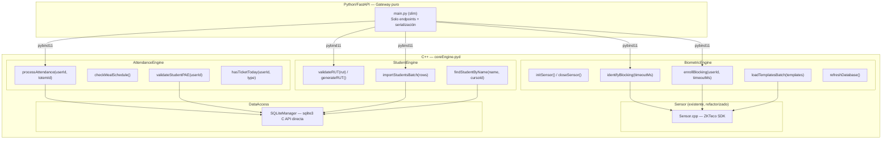

# Plan de Migración a C++: Pydigitador Core Engine

## Objetivo

Migrar **toda la lógica pesada** del sistema a una librería C++ (`coreEngine.pyd`) que se expone a Python vía pybind11. Python/FastAPI queda **exclusivamente** como gateway HTTP/WS: recibe requests, invoca C++, devuelve JSON.

---

## Arquitectura Objetivo



---

## ¿Por qué SQLite C API y no SQLAlchemy?

| Aspecto | SQLAlchemy (actual) | SQLite C API (propuesto) |
|---------|-------------------|------------------------|
| Overhead por query | ~5-20ms (sesión + ORM mapping) | ~0.1-1ms (prepared statement) |
| Sesiones por request | 6 sesiones independientes | 1 conexión persistente |
| Latencia `procesarAsistencia` | ~60-160ms solo en DB | ~5-15ms |
| Complejidad | Session lifecycle, lazy loading, etc. | SQL directo, sin magia |
| Thread safety | `check_same_thread=False` (hack) | `SQLITE_OPEN_FULLMUTEX` nativo |

> [!IMPORTANT]
> No estamos eliminando SQLAlchemy del proyecto. Python lo sigue usando para los endpoints CRUD no-críticos (listar usuarios, editar, exportar Excel). Solo el **flujo crítico de asistencia** y las operaciones batch pasan a C++.

---

## Estructura de Archivos C++ Propuesta

```
infra/Hardware/
├── include/
│   ├── libzkfp.h          # (existente) SDK ZKTeco
│   └── libzkfperrdef.h    # (existente) SDK ZKTeco
│
├── Sensor.h               # (existente, sin cambios)
├── Sensor.cpp             # (existente, sin cambios)
│
├── core/                  # ← NUEVO: todo el engine
│   ├── BiometricEngine.h
│   ├── BiometricEngine.cpp
│   ├── AttendanceEngine.h
│   ├── AttendanceEngine.cpp
│   ├── StudentEngine.h
│   ├── StudentEngine.cpp
│   ├── SQLiteManager.h
│   ├── SQLiteManager.cpp
│   └── Types.h            # Structs compartidos
│
├── coreEngineWrapper.cpp  # ← NUEVO: pybind11 bindings
│
├── x64lib/
│   └── libzkfp.lib        # (existente)
│
└── sensorWrapper.cpp      # (existente, se depreca gradualmente)
```

---

## Diseño Detallado por Módulo C++

### 1. `Types.h` — Estructuras compartidas

```cpp
// infra/Hardware/core/Types.h
#pragma once
#include <string>
#include <vector>
#include <optional>

namespace core {

struct IdentifyResult {
    bool success;
    int userId;
    int score;
    std::string errorMsg;
};

struct EnrollResult {
    bool success;
    std::vector<unsigned char> templateData;  // para guardar en SQLite
    std::string errorMsg;
};

struct AttendanceResult {
    std::string estado;     // "Aprobado" o "Rechazado"
    std::string mensaje;
    std::string tipoRacion; // "desayuno" o "almuerzo"
    // Datos del alumno (solo si aprobado)
    std::string nombreAlumno;
    std::string rutAlumno;
    std::string cursoAlumno;
    int registroId;
    int ticketId;
};

struct StudentRow {
    std::string nombre;
    std::string rut;          // puede estar vacío
    std::string cursoTexto;   // ej: "1 Basico A"
    bool esPae;
};

struct ImportResult {
    bool success;
    int insertados;
    int actualizados;
    int omitidos;
    std::string errorMsg;
};

struct StudentInfo {
    int id;
    std::string nombre;
    std::string rut;
    std::string curso;
    bool tieneHuella;
};

} // namespace core
```

---

### 2. `SQLiteManager` — Acceso directo a la DB

```cpp
// infra/Hardware/core/SQLiteManager.h
#pragma once
#include <string>
#include <vector>
#include <optional>
#include <sqlite3.h>
#include "Types.h"

namespace core {

class SQLiteManager {
public:
    explicit SQLiteManager(const std::string& dbPath);
    ~SQLiteManager();

    bool open();
    void close();
    bool isOpen() const;

    // === Flujo de asistencia (una sola transacción) ===
    bool existeUsuario(int userId);
    bool esPAE(int userId);
    bool yaRecibioTicketHoy(int userId, const std::string& tipo);
    int crearRegistro(int userId, int totemId, 
                      const std::string& estado, const std::string& tipo);
    int generarTicket(int registroId, int userId, const std::string& tipo);
    std::optional<StudentInfo> obtenerDatosAlumno(int userId);

    // === Huellas ===
    struct HuellaRecord { int userId; std::vector<unsigned char> blob; };
    std::vector<HuellaRecord> obtenerTodasLasHuellas();
    bool guardarHuella(int userId, const std::vector<unsigned char>& blob);

    // === Estudiantes batch ===
    int resolverCursoId(const std::string& cursoTexto);
    ImportResult importarEstudiantesBatch(const std::vector<StudentRow>& rows);
    
    // === Utilidades ===
    std::vector<StudentInfo> buscarPorNombre(const std::string& nombre, 
                                              std::optional<int> cursoId);

private:
    std::string m_dbPath;
    sqlite3* m_db = nullptr;
    
    // Prepared statements cacheados
    sqlite3_stmt* m_stmtExisteUsuario = nullptr;
    sqlite3_stmt* m_stmtEsPAE = nullptr;
    sqlite3_stmt* m_stmtYaRecibioTicket = nullptr;
    sqlite3_stmt* m_stmtCrearRegistro = nullptr;
    sqlite3_stmt* m_stmtGenerarTicket = nullptr;
    sqlite3_stmt* m_stmtObtenerAlumno = nullptr;
    sqlite3_stmt* m_stmtGuardarHuella = nullptr;
    
    void prepararStatements();
    void finalizarStatements();
};

} // namespace core
```

> [!TIP]
> Los **prepared statements** cacheados son la clave de rendimiento. En vez de parsear SQL en cada llamada (~5ms), el statement se parsea UNA vez al abrir la DB y se reutiliza con `sqlite3_reset()` + `sqlite3_bind()` (~0.05ms).

---

### 3. `BiometricEngine` — Operaciones bloqueantes de sensor

```cpp
// infra/Hardware/core/BiometricEngine.h
#pragma once
#include "../Sensor.h"
#include "SQLiteManager.h"
#include "Types.h"
#include <mutex>
#include <vector>
#include <utility>

namespace core {

class BiometricEngine {
public:
    BiometricEngine(Sensor& sensor, SQLiteManager& db);
    
    // Inicialización
    std::pair<bool, std::string> inicializar();
    void cerrar();
    
    // === Operaciones bloqueantes (liberan el GIL) ===
    
    // Espera a que pongan el dedo, captura y busca en la DB RAM del sensor
    IdentifyResult identifyBlocking(int timeoutMs = 20000);
    
    // Espera dedo, captura, guarda en RAM del sensor Y en SQLite
    EnrollResult enrollBlocking(int userId, int timeoutMs = 30000);
    
    // Captura + identifica + retorna también los bytes raw
    // (para el flujo de registro donde necesitamos los bytes)
    struct CaptureIdentifyResult {
        int userId;
        int score;
        std::vector<unsigned char> templateBytes;
    };
    CaptureIdentifyResult captureAndIdentify(int timeoutMs = 20000);

    // === Operaciones batch ===
    
    // Carga todas las huellas de SQLite a la RAM del sensor
    struct BatchLoadResult { int cargadas; int fallidas; };
    BatchLoadResult loadTemplatesFromDB();
    
    // Reinicia sensor + recarga (para edición de huellas)
    bool refreshDatabase();
    
    // Vincula una huella ya capturada (evita segundo scan)
    bool vincularHuella(int userId, const std::vector<unsigned char>& templateData);

private:
    Sensor& m_sensor;
    SQLiteManager& m_db;
    std::mutex m_hwLock;
};

} // namespace core
```

**Detalle clave** — `identifyBlocking()` reemplaza el busy-wait de Python:

```cpp
// ANTES (Python — HuellaService.identificar_usuario):
//   while True:
//       with self.hardware_lock:
//           exito, data = self.sensor.capture_template_immediate()  ← call a C++
//           if exito:
//               found, uid, score = self.sensor.db_identify(data)   ← call a C++
//               return uid, score
//       time.sleep(0.1)                                             ← GIL burn

// DESPUÉS (C++ — BiometricEngine::identifyBlocking):
IdentifyResult BiometricEngine::identifyBlocking(int timeoutMs) {
    std::lock_guard<std::mutex> lock(m_hwLock);
    
    // captureCreateTemplate ya tiene su propio while-loop con timeout
    std::vector<unsigned char> templateData;
    if (!m_sensor.captureCreateTemplate(templateData)) {
        return {false, -1, 0, "Timeout o error de captura"};
    }
    
    int userId = 0, score = 0;
    if (!m_sensor.DBIdentify(templateData, userId, score)) {
        return {false, -1, 0, "Huella no reconocida"};
    }
    
    return {true, userId, score, ""};
}
// Una sola llamada Python→C++ en vez de N llamadas en loop
```

---

### 4. `AttendanceEngine` — Lógica de negocio de asistencia

```cpp
// infra/Hardware/core/AttendanceEngine.h
#pragma once
#include "SQLiteManager.h"
#include "Types.h"
#include <string>

namespace core {

class AttendanceEngine {
public:
    explicit AttendanceEngine(SQLiteManager& db);
    
    // === El flujo completo en UNA llamada C++ ===
    // Reemplaza: validar_usuario + validar_usuario_pae + 
    //            ya_recibio_ticket_hoy + crear_registro + 
    //            generar_ticket + obtener_datos_alumno
    AttendanceResult processAttendance(int userId, int totemId);
    
    // === Utilidades de horario ===
    static std::string checkMealSchedule();       // "desayuno", "almuerzo", o ""
    static std::string mealScheduleDescription(); // texto legible

private:
    SQLiteManager& m_db;
};

} // namespace core
```

**El corazón de la migración** — `processAttendance()` convierte 6 queries en 1 transacción:

```cpp
AttendanceResult AttendanceEngine::processAttendance(int userId, int totemId) {
    AttendanceResult result;
    
    // 1. Horario
    std::string tipo = checkMealSchedule();
    if (tipo.empty()) {
        result.estado = "Rechazado";
        result.mensaje = "Fuera de horario. " + mealScheduleDescription();
        return result;
    }
    
    // 2. ¿Existe el usuario?
    if (!m_db.existeUsuario(userId)) {
        result.estado = "Rechazado";
        result.mensaje = "Usuario no encontrado en el sistema";
        return result;
    }
    
    // 3. ¿Es PAE?
    if (!m_db.esPAE(userId)) {
        result.estado = "Rechazado";
        result.mensaje = "El alumno no pertenece al plan PAE";
        return result;
    }
    
    // 4. ¿Ya recibió ticket hoy?
    if (m_db.yaRecibioTicketHoy(userId, tipo)) {
        result.estado = "Rechazado";
        result.mensaje = "Ya se emitió un ticket de " + tipo + " hoy";
        return result;
    }
    
    // 5. Crear registro + ticket (atómico)
    int regId = m_db.crearRegistro(userId, totemId, "Aprobado", tipo);
    if (regId <= 0) {
        result.estado = "Rechazado";
        result.mensaje = "Error al guardar el registro";
        return result;
    }
    
    int ticketId = m_db.generarTicket(regId, userId, tipo);
    
    // 6. Datos del alumno
    auto alumno = m_db.obtenerDatosAlumno(userId);
    
    result.estado = "Aprobado";
    result.mensaje = "Ticket de " + tipo + " emitido correctamente";
    result.tipoRacion = tipo;
    result.registroId = regId;
    result.ticketId = ticketId;
    if (alumno) {
        result.nombreAlumno = alumno->nombre;
        result.rutAlumno = alumno->rut;
        result.cursoAlumno = alumno->curso;
    }
    
    return result;
    // Total: ~5-15ms vs ~60-160ms actual
}
```

---

### 5. `StudentEngine` — Utilidades de estudiantes

```cpp
// infra/Hardware/core/StudentEngine.h
#pragma once
#include "SQLiteManager.h"
#include "Types.h"
#include <string>
#include <vector>

namespace core {

class StudentEngine {
public:
    explicit StudentEngine(SQLiteManager& db);
    
    // Validación de RUT chileno (Módulo 11)
    static bool validateRUT(const std::string& rut);
    static std::string generateProvisionalRUT();
    static std::string calculateDV(const std::string& body);
    
    // Importación batch desde datos ya parseados
    // (Python parsea el Excel con openpyxl, C++ hace el upsert masivo)
    ImportResult importStudentsBatch(const std::vector<StudentRow>& rows);
    
    // Búsqueda rápida
    std::vector<StudentInfo> findByName(const std::string& name,
                                         std::optional<int> cursoId = std::nullopt);

private:
    SQLiteManager& m_db;
};

} // namespace core
```

---

### 6. `coreEngineWrapper.cpp` — Pybind11 Bindings

```cpp
// infra/Hardware/coreEngineWrapper.cpp
#include <pybind11/pybind11.h>
#include <pybind11/stl.h>
#include <pybind11/stl/optional.h>
#include "core/BiometricEngine.h"
#include "core/AttendanceEngine.h"
#include "core/StudentEngine.h"
#include "core/SQLiteManager.h"
#include "Sensor.h"

namespace py = pybind11;
using namespace core;

PYBIND11_MODULE(coreEngine, m) {
    m.doc() = "Pydigitador Core Engine — Biometrics + Attendance + Students";

    // --- Structs ---
    py::class_<IdentifyResult>(m, "IdentifyResult")
        .def_readonly("success", &IdentifyResult::success)
        .def_readonly("user_id", &IdentifyResult::userId)
        .def_readonly("score", &IdentifyResult::score)
        .def_readonly("error_msg", &IdentifyResult::errorMsg);

    py::class_<EnrollResult>(m, "EnrollResult")
        .def_readonly("success", &EnrollResult::success)
        .def_readonly("template_data", &EnrollResult::templateData)
        .def_readonly("error_msg", &EnrollResult::errorMsg);

    py::class_<AttendanceResult>(m, "AttendanceResult")
        .def_readonly("estado", &AttendanceResult::estado)
        .def_readonly("mensaje", &AttendanceResult::mensaje)
        .def_readonly("tipo_racion", &AttendanceResult::tipoRacion)
        .def_readonly("nombre_alumno", &AttendanceResult::nombreAlumno)
        .def_readonly("rut_alumno", &AttendanceResult::rutAlumno)
        .def_readonly("curso_alumno", &AttendanceResult::cursoAlumno)
        .def_readonly("registro_id", &AttendanceResult::registroId)
        .def_readonly("ticket_id", &AttendanceResult::ticketId);

    py::class_<ImportResult>(m, "ImportResult")
        .def_readonly("success", &ImportResult::success)
        .def_readonly("insertados", &ImportResult::insertados)
        .def_readonly("actualizados", &ImportResult::actualizados)
        .def_readonly("omitidos", &ImportResult::omitidos)
        .def_readonly("error_msg", &ImportResult::errorMsg);

    py::class_<StudentRow>(m, "StudentRow")
        .def(py::init<>())
        .def_readwrite("nombre", &StudentRow::nombre)
        .def_readwrite("rut", &StudentRow::rut)
        .def_readwrite("curso_texto", &StudentRow::cursoTexto)
        .def_readwrite("es_pae", &StudentRow::esPae);

    py::class_<StudentInfo>(m, "StudentInfo")
        .def_readonly("id", &StudentInfo::id)
        .def_readonly("nombre", &StudentInfo::nombre)
        .def_readonly("rut", &StudentInfo::rut)
        .def_readonly("curso", &StudentInfo::curso)
        .def_readonly("tiene_huella", &StudentInfo::tieneHuella);

    // --- SQLiteManager ---
    py::class_<SQLiteManager>(m, "SQLiteManager")
        .def(py::init<const std::string&>())
        .def("open", &SQLiteManager::open)
        .def("close", &SQLiteManager::close);

    // --- Sensor (existente, se re-expone) ---
    py::class_<Sensor>(m, "Sensor")
        .def(py::init<>())
        .def("init_sensor", &Sensor::initSensor)
        .def("close_sensor", &Sensor::closeSensor);

    // --- BiometricEngine ---
    py::class_<BiometricEngine>(m, "BiometricEngine")
        .def(py::init<Sensor&, SQLiteManager&>())
        .def("inicializar", &BiometricEngine::inicializar)
        .def("cerrar", &BiometricEngine::cerrar)
        .def("identify_blocking", [](BiometricEngine& self, int timeout) {
            // LIBERAR EL GIL durante la espera del sensor
            py::gil_scoped_release release;
            return self.identifyBlocking(timeout);
        }, py::arg("timeout_ms") = 20000)
        .def("enroll_blocking", [](BiometricEngine& self, int userId, int timeout) {
            py::gil_scoped_release release;
            return self.enrollBlocking(userId, timeout);
        }, py::arg("user_id"), py::arg("timeout_ms") = 30000)
        .def("capture_and_identify", [](BiometricEngine& self, int timeout) {
            py::gil_scoped_release release;
            return self.captureAndIdentify(timeout);
        }, py::arg("timeout_ms") = 20000)
        .def("load_templates_from_db", &BiometricEngine::loadTemplatesFromDB)
        .def("refresh_database", &BiometricEngine::refreshDatabase)
        .def("vincular_huella", &BiometricEngine::vincularHuella);

    // --- AttendanceEngine ---
    py::class_<AttendanceEngine>(m, "AttendanceEngine")
        .def(py::init<SQLiteManager&>())
        .def("process_attendance", &AttendanceEngine::processAttendance)
        .def_static("check_meal_schedule", &AttendanceEngine::checkMealSchedule)
        .def_static("meal_schedule_description", &AttendanceEngine::mealScheduleDescription);

    // --- StudentEngine ---
    py::class_<StudentEngine>(m, "StudentEngine")
        .def(py::init<SQLiteManager&>())
        .def_static("validate_rut", &StudentEngine::validateRUT)
        .def_static("generate_provisional_rut", &StudentEngine::generateProvisionalRUT)
        .def_static("calculate_dv", &StudentEngine::calculateDV)
        .def("import_students_batch", &StudentEngine::importStudentsBatch)
        .def("find_by_name", &StudentEngine::findByName,
             py::arg("name"), py::arg("curso_id") = std::nullopt);
}
```

> [!IMPORTANT]
> Nota el `py::gil_scoped_release` en las funciones bloqueantes. Esto **libera el GIL** para que Python pueda seguir procesando otros requests de FastAPI mientras C++ espera el dedo en el sensor. Sin esto, todo el servidor se bloquea.

---

## Cómo queda `main.py` después de la migración

```python
# main.py — SOLO gateway (~200 líneas vs 778 actuales)

import coreEngine  # La nueva librería C++

# Inicialización global
sensor = coreEngine.Sensor()
db = coreEngine.SQLiteManager("ruta/a/biopae.db")
db.open()

biometric = coreEngine.BiometricEngine(sensor, db)
attendance = coreEngine.AttendanceEngine(db)
students = coreEngine.StudentEngine(db)

# Startup
biometric.inicializar()
biometric.load_templates_from_db()

# --- Endpoint de asistencia (antes: 6 queries Python) ---
@app.websocket("/ws/totem")
async def ws_totem(websocket: WebSocket):
    await websocket.accept()
    
    schedule = coreEngine.AttendanceEngine.check_meal_schedule()
    if not schedule:
        await websocket.send_json({"estado": "Rechazado", ...})
        return
    
    # UNA llamada C++ bloqueante (libera GIL)
    result = await asyncio.get_running_loop().run_in_executor(
        None, lambda: biometric.identify_blocking(20000)
    )
    
    if not result.success:
        await websocket.send_json({"estado": "Rechazado", ...})
        return
    
    # UNA llamada C++ para todo el flujo de negocio
    ticket = attendance.process_attendance(result.user_id, TOTEM_ID)
    await websocket.send_json({
        "estado": ticket.estado,
        "mensaje": ticket.mensaje,
        "tipo_racion": ticket.tipo_racion,
        "alumno": {
            "nombre": ticket.nombre_alumno,
            "rut": ticket.rut_alumno,
            "curso": ticket.curso_alumno,
        }
    })
```

---

## Script de Compilación Actualizado

```python
# compile_core.py
import sys, os, pybind11
from setuptools import setup, Extension

hw = os.path.abspath("infra/Hardware")
core = os.path.join(hw, "core")

ext = Extension(
    "coreEngine",
    sources=[
        os.path.join(hw, "coreEngineWrapper.cpp"),
        os.path.join(hw, "Sensor.cpp"),
        os.path.join(core, "BiometricEngine.cpp"),
        os.path.join(core, "AttendanceEngine.cpp"),
        os.path.join(core, "StudentEngine.cpp"),
        os.path.join(core, "SQLiteManager.cpp"),
    ],
    include_dirs=[
        pybind11.get_include(),
        hw,
        os.path.join(hw, "include"),
        core,
    ],
    library_dirs=[os.path.join(hw, "x64lib")],
    libraries=["libzkfp", "sqlite3"],  # Necesitamos linkear sqlite3
    language="c++",
    extra_compile_args=["/std:c++17", "/O2"] if sys.platform == "win32" 
                        else ["-std=c++17", "-O2"],
)

sys.argv = [sys.argv[0], "build_ext", "--inplace"]
setup(name="coreEngine", ext_modules=[ext])
```

> [!WARNING]
> **Dependencia nueva: `sqlite3.lib`**
> SQLite viene como un solo archivo C (`sqlite3.c` + `sqlite3.h`). Hay dos opciones:
> 1. **Amalgamation** (recomendado): Descargar `sqlite3.c` de sqlite.org y compilarlo junto con el proyecto
> 2. **Pre-built**: Descargar `sqlite3.lib` + `sqlite3.dll` para Windows x64

---

## Plan de Ejecución

### Fase 0 — Preparación (½ día)
- [ ] Eliminar los ~15 archivos de código muerto (Tier 3 del diagnóstico)
- [ ] Descargar SQLite amalgamation (`sqlite3.c` + `sqlite3.h`)
- [ ] Crear estructura de directorios `infra/Hardware/core/`
- [ ] Verificar compilación del wrapper existente sigue funcionando

---

### Fase 1 — SQLiteManager + AttendanceEngine (1-2 días)
- [ ] Implementar `Types.h` con todas las structs
- [ ] Implementar `SQLiteManager.cpp`:
  - `open()` / `close()`
  - `prepararStatements()` — cachear todos los prepared statements
  - `existeUsuario()`, `esPAE()`, `yaRecibioTicketHoy()`
  - `crearRegistro()`, `generarTicket()`
  - `obtenerDatosAlumno()` (con JOIN a cursos)
- [ ] Implementar `AttendanceEngine.cpp`:
  - `checkMealSchedule()` — port directo de `horarioService.py`
  - `processAttendance()` — el flujo completo
- [ ] Agregar bindings pybind11 para `AttendanceEngine`
- [ ] Compilar y testear con un script Python standalone
- [ ] **Punto de validación**: `process_attendance(userId, totemId)` retorna el mismo resultado que el flujo Python actual

---

### Fase 2 — BiometricEngine (1 día)
- [ ] Implementar `BiometricEngine.cpp`:
  - `identifyBlocking()` — capture + identify en un solo call
  - `enrollBlocking()` — capture + save en hardware + save en SQLite
  - `loadTemplatesFromDB()` — lee de SQLite, inyecta en RAM sensor
  - `refreshDatabase()` — close + init + reload
  - `vincularHuella()` — save sin captura
- [ ] Agregar bindings con `py::gil_scoped_release`
- [ ] Compilar y testear
- [ ] **Punto de validación**: Enrolar una huella, cerrar el proceso, re-abrir, identificar exitosamente

---

### Fase 3 — StudentEngine + Integración (1 día)
- [ ] Implementar `StudentEngine.cpp`:
  - `validateRUT()` — Módulo 11
  - `generateProvisionalRUT()` — generación aleatoria
  - `importStudentsBatch()` — upsert masivo con transacción
  - `findByName()` — búsqueda LIKE
- [ ] Implementar bindings completos en `coreEngineWrapper.cpp`
- [ ] Crear `compile_core.py`
- [ ] Compilar como `coreEngine.pyd`
- [ ] **Punto de validación**: Importar el Excel de JUNAEB a través de C++ en <1 segundo

---

### Fase 4 — Reescribir main.py como Gateway (1 día)
- [ ] Reescribir `main.py` usando solo `coreEngine`:
  - `/ws/totem` → `biometric.identify_blocking()` + `attendance.process_attendance()`
  - `/ws/huella/enrolar/{id}` → `biometric.enroll_blocking()`
  - `/ws/huella/capturar-identificar` → `biometric.capture_and_identify()`
  - `/api/totem/acceso` + `/api/huella/pooling` → deprecar (el WS es mejor)
  - `/api/huella/vincular` → `biometric.vincular_huella()`
  - `/api/usuarios/importar` → parsear Excel en Python, `students.import_students_batch()`
  - `/api/ticket/procesar` → `attendance.process_attendance()`
- [ ] Mantener endpoints CRUD simples en SQLAlchemy (listar, editar, exportar)
- [ ] Eliminar `HuellaService.py`, `huellaController.py`, `RegistrosController.py`
- [ ] Eliminar `sensorWrapper.pyd` (reemplazado por `coreEngine.pyd`)
- [ ] **Punto de validación**: Todo el flujo end-to-end funciona desde el frontend

---

## Resumen de lo que queda en cada lenguaje

### C++ (`coreEngine.pyd`) — ~1200 líneas estimadas

| Función | Reemplaza |
|---------|-----------|
| `BiometricEngine::identifyBlocking()` | `HuellaService.identificar_usuario()` (80 líneas Python + busy-wait) |
| `BiometricEngine::enrollBlocking()` | `HuellaController.procesar_contexto("enrolar")` (40 líneas) |
| `BiometricEngine::loadTemplatesFromDB()` | `HuellaService.cargar_huellas_iniciales()` (50 líneas) |
| `BiometricEngine::refreshDatabase()` | `HuellaService.refrescar_bd_hardware()` (20 líneas) |
| `AttendanceEngine::processAttendance()` | `RegistrosController.procesarAsistencia()` + 4 sub-funciones (120 líneas) |
| `AttendanceEngine::checkMealSchedule()` | `horarioService.py` (28 líneas) |
| `StudentEngine::validateRUT()` | `RunService.validarRun()` (50 líneas) |
| `StudentEngine::generateProvisionalRUT()` | `_generar_rut_provisional()` (10 líneas) |
| `StudentEngine::importStudentsBatch()` | `importar_usuarios_desde_excel()` parte DB (80 líneas) |
| `SQLiteManager` | `UserRepository` + `RegistroRepository` para path crítico |

### Python (`main.py`) — ~200-250 líneas estimadas

| Función | Razón de quedarse |
|---------|-------------------|
| Endpoints HTTP/WS | FastAPI es superior para routing |
| Serialización JSON | Pydantic es más ergonómico |
| CORS / middleware | Trivial |
| Excel parsing (openpyxl) | I/O bound, no CPU bound |
| CRUD no-crítico (listar, editar usuarios) | SQLAlchemy está bien para queries simples |
| Exportar Excel | openpyxl maneja el formato |

---

## Verificación

### Benchmarks esperados

| Métrica | Python actual | C++ estimado | Mejora |
|---------|--------------|--------------|--------|
| Identificación end-to-end | ~300-700ms | ~200-500ms | -30% (hardware-bound) |
| `processAttendance()` (DB) | ~60-160ms | ~5-15ms | **10x** |
| Startup (500 huellas) | ~5-10s | ~0.5-1s | **10x** |
| Importación 500 alumnos | ~15-30s | ~1-3s | **10x** |
| CPU idle (busy-wait) | ~5-15% | ~0% | **eliminado** |

### Tests para validar cada fase

```bash
# Fase 1: AttendanceEngine
python -c "
import coreEngine
db = coreEngine.SQLiteManager('infra/DB/biopae.db')
db.open()
ae = coreEngine.AttendanceEngine(db)
r = ae.process_attendance(1, 1)
print(f'{r.estado}: {r.mensaje}')
"

# Fase 2: BiometricEngine  
python -c "
import coreEngine
sensor = coreEngine.Sensor()
db = coreEngine.SQLiteManager('infra/DB/biopae.db')
db.open()
be = coreEngine.BiometricEngine(sensor, db)
be.inicializar()
loaded = be.load_templates_from_db()
print(f'Cargadas: {loaded.cargadas}, Fallidas: {loaded.fallidas}')
"

# Fase 3: StudentEngine
python -c "
import coreEngine
assert coreEngine.StudentEngine.validate_rut('12345678-5') == True
rut = coreEngine.StudentEngine.generate_provisional_rut()
print(f'RUT provisional: {rut}')
"
```

---

## Open Questions

> [!IMPORTANT]
> **¿Quieres empezar desde Fase 0 (limpieza) + Fase 1 (AttendanceEngine + SQLiteManager) como primera iteración?**
> Es lo que da mayor impacto con menor riesgo — el sensor sigue funcionando con el wrapper actual mientras se construye el nuevo engine.

> [!IMPORTANT]
> **SQLite amalgamation vs pre-built**: ¿Prefieres compilar SQLite desde source (una sola línea extra en el build) o descargar el `.lib` pre-compilado?

> [!WARNING]
> **Compatibilidad del `sensorWrapper.pyd` actual**: Durante la transición habrá un periodo donde coexisten `sensorWrapper.pyd` (viejo) y `coreEngine.pyd` (nuevo). ¿Es aceptable o prefieres migrar todo de golpe?
